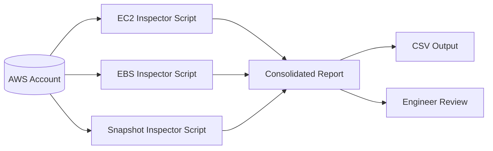

# AWS Cost Optimisation Toolkit v2

A practical toolkit for surfacing common AWS waste patterns and producing lightweight optimisation reports. This version is designed as a portfolio-friendly example of **cost-aware platform engineering** rather than a finance-only script collection.

## What this repository demonstrates

- Boto3-based AWS inventory and waste detection
- Clear CLI-driven scripts
- CSV report generation
- Consolidated reporting
- Operationally useful recommendations
- Engineering-first approach to cloud cost control

## Why this matters

Cost optimisation is one of the most valuable DevOps / SRE skills because it sits at the intersection of:

- infrastructure visibility
- workload design
- scaling policy quality
- operational discipline
- business impact

This repo maps well to real work such as rightsizing, identifying idle assets, and building repeatable review processes.

## Architecture



## Repository structure

```text
.
├── reports/
├── requirements.txt
├── sample-output/
│   └── optimisation-report.csv
├── scripts/
│   ├── common.py
│   ├── idle_ec2.py
│   ├── old_snapshots.py
│   ├── report_merge.py
│   └── unattached_ebs.py
└── screenshots/
    └── README.md
```

## Setup

```bash
python3 -m venv .venv
source .venv/bin/activate
pip install -r requirements.txt
```

Authenticate using AWS CLI credentials, environment variables, or an instance role.

## Usage

```bash
python3 scripts/idle_ec2.py --region eu-west-2
python3 scripts/unattached_ebs.py --region eu-west-2
python3 scripts/old_snapshots.py --region eu-west-2 --days 30
python3 scripts/report_merge.py
```

## Example output

The scripts generate simple CSV files suitable for:
- monthly reviews
- quick wins
- attaching to engineering recommendations
- extending into dashboards or scheduled jobs

## Suggested recruiter demo flow

1. Run each detector
2. Open the consolidated CSV
3. Explain how you would validate deletion or downsizing candidates
4. Describe how this evolves into a recurring optimisation workflow

## Practical caveats

Recommendations should always be reviewed in business context. Some apparently idle resources may be:
- DR assets
- infrequently used but necessary
- tied to compliance requirements
- awaiting scheduled cutover or migration

## Suggested v3 enhancements

- Cost Explorer integration
- CloudWatch-driven rightsizing
- Slack notifications
- multi-account support
- tagging compliance checks
- monthly trend reports

## Notes

This repository is intentionally simple enough to be readable but structured enough to feel useful in a real platform team context.
